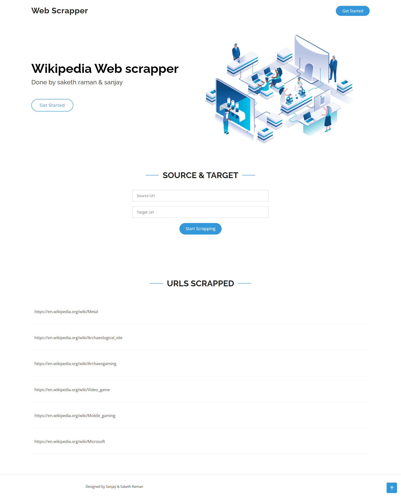

# Objective

The objective of the package is to crawl Wikipedia articles in order to find a path from a given source page to a destination page through hyperlinks.

<br>

# Overview

The web scraper works by categorizing the destination page into one of ten possible categories: Business, Entertainment, Food, Graphics, Historical, Medical, Politics, Space, Sport, and Technology. The classification is performed using a Gaussian Naive Bayes classifier. The scraper then evaluates all pages that are hyperlinked to the source page, and estimates how relevant the pages are to the category of the destination page. Pages are visited in decreasing order of relevance to the category of the destination page, and the process is repeated until the destination is reached.

<br>

# Dataset Details

```
Dataset name: Dataset Text Document Classification
Uploader: Jensen Baxter
Source: Kaggle
```
Link to dataset : &emsp;<a href="https://www.kaggle.com/datasets/jensenbaxter/10dataset-text-document-classification">Dataset-text-document-classification</a>

<br>

# Technologies Used

```
Model            - Gaussian Naive Bayes
Search Algorithm - Greedy Best First Search
Frontend         - HTML with Bootstrap, jQuery
Backend          - Django    
```
<br>

# Website

<br>



<br>

# Team 

```
Saketh Raman KS - 19PW26
Sanjay T - 19PW28
```
<br>

# Project Motive

<h3>Final Project for Artificial Intelligence</h3>